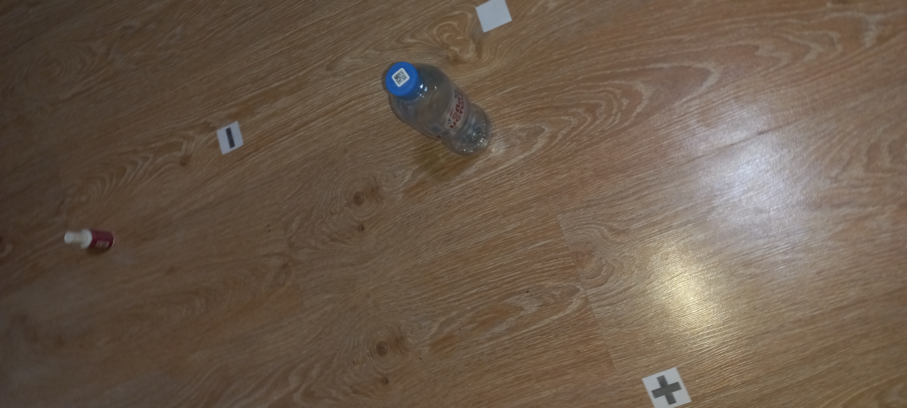

Для обучения модели потребовались 259 фотографий, на них запечатлены вместе или по отдельности 4 объекта: бутылка и три маркера системы координат.



С помощью приложения labelimg каждое фото было размечено. Теперь они делятся на две категории: обучающие данные (train) и проверочными (val).

Далее создаем файл dataset.yaml. В нем указан путь к папке data и относительный от нее пути к train и val фотографиям\меткам 

```yaml
path: /Users/coldreign/robotStasik/NN/data  

train: images/train
val: images/val

names:
  0: 0
  1: y
  2: bottle
  3: x
```
Обучаем и сохраняем модель
```py

from ultralytics import YOLO

model = YOLO('yolov8n.pt')
results = model.train(data='dataset.yaml',device=0, epochs=50, imgsz=640, plots=True, save_period=1)

```
Далее используем нашу обученную модель в программе
```python
import cv2
import numpy as np
from ultralytics import YOLO

model = YOLO("/Users/coldreign/robotStasik/runs/detect/train3/weights/best.pt")
```

Задаем расшиерние получаемой картинки и длину квадрата системы координат
```python
cap = cv2.VideoCapture(0)
cap.set(cv2.CAP_PROP_FRAME_WIDTH, 820)
cap.set(cv2.CAP_PROP_FRAME_HEIGHT, 400)
square_size = 25
```
Дальше запускаем цикл, который будет идти до тех пор пока мы не остановим вручную или при нажатие q.
Считываем кадр с камеры и затемняем его, чтобы избежать засветов.
Создаем объект модели, который будет давать нам результат оценки кадра с 35% шансом совпадения.
Заменяем кадр на новый вместе с bounding box.

```python

while True:
    ret, frame = cap.read()
    if not ret:
        print("Ошибка получения кадра")
        break
    frame = cv2.convertScaleAbs(frame, alpha=0.8, beta=-10)
    results = model.predict(source=frame, conf=0.35, verbose=False)

    frame = results[0].plot()

    ##
    ##
    ##

    if cv2.waitKey(1) & 0xFF == ord('q'):
        break


cap.release()
cv2.destroyAllWindows()

```

Создаем словарь для замеченых объектов 
Перебираем двумя цикламикаждый замеченный объект и даем ему координаты пикселей на кадре.
Находим центральные точки для объектов !="bottle", а для бутылки нам нужно будет смотреть не на центральную 
точку, а середину нижней стороны.
С условием что были замечены все объекты задаем новые переменные, которые будут означать сколько пикселей от 0 по x и y.
С условием что камера направлена перпендекулярно системе координат предполагаем 4 точку для квадрата.
Создаем два массива точек в пикселях и сантиметрах

```python

object_positions = {}

    for result in results:
        for box in result.boxes:
            x1, y1, x2, y2 = map(int, box.xyxy[0])
            class_id = int(box.cls[0])
            label = model.names[class_id]
            x_c = (x1 + x2) / 2
            y_c = (y1 + y2) / 2
            if label != "bottle":
                object_positions[label] = (x_c, y_c)
            else:
                object_positions[label] = (x2 -(x2-x1), y2)

    if all(label in object_positions for label in ["0", "x", "y", "bottle"]):
        x_0, y_0 = object_positions["0"]
        x_x, y_x = object_positions["x"]
        x_y, y_y = object_positions["y"]
        x_b, y_b = object_positions["bottle"]

        x_xy = x_x + (x_y - x_0)
        y_xy = y_x + (y_y - y_0)

        pts_pixel = np.array([
            [x_0, y_0],
            [x_x, y_x],
            [x_y, y_y],
            [x_xy, y_xy]
        ], dtype=np.float32)

        pts_real = np.array([
            [0, 0],
            [square_size, 0],
            [0, square_size],
            [square_size, square_size]
        ], dtype=np.float32)

```
Вычисляем матрицу гомографии задавая в метод findHomography наши два массива, создаем еще массив с координатами пикселей бутылки.
Изменяем форму нового массива. Применяем матрицу гомографии к точкам бутылки и получаем координаты бутылки в см.

```py
        homography_matrix, _ = cv2.findHomography(pts_pixel, pts_real)

        bottle_pixel = np.array([[x_b, y_b]], dtype=np.float32)
        bottle_real = cv2.perspectiveTransform(bottle_pixel.reshape(-1, 1, 2), homography_matrix)


        x_real, y_real = bottle_real[0][0]

        cv2.putText(frame, f"Bottle: X={x_real:.1f}cm, Y={y_real:.1f}cm", 
                    (20, 40), cv2.FONT_HERSHEY_SIMPLEX, 0.7, (0, 255, 0), 2)
```